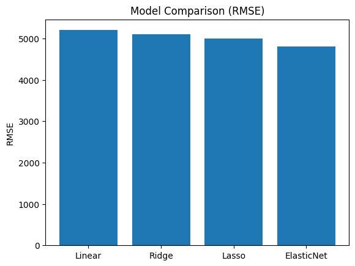

# Ridge, Lasso and ElasticNet Salary Prediction

This project compares three regularized regression models for predicting employee salaries.

Models used:
- Ridge Regression
- Lasso Regression
- ElasticNet

The models are evaluated using RMSE, MAE and R² metrics.

## Project structure

data/ – dataset  
notebooks/ – analysis notebook  
results/ – visualizations  

## Technologies

- Python
- pandas
- scikit-learn
- matplotlib

## Dataset

The dataset contains demographic and job-related information
about employees used to predict salary.

Target variable:
Salary

## How to run

Install dependencies:

```bash
pip install -r requirements.txt
```

Then open the notebook:

```
notebooks/regression_analysis.ipynb
```
## Model comparison


